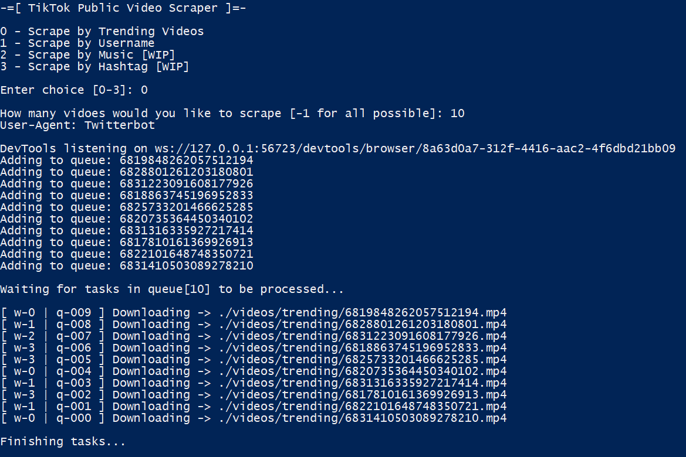

# TikTok API Reverse Engineering
Initial commit as old code is deprecated because urls now require anti-spam parameters and signatures.

# Instructions
Execute run.py, downloaded files will be placed in ./videos/[username]
```
python run.py
```


# Requirements
## Selenium
Learn more about Selenium here https://pypi.org/project/selenium/
```
pip install selenium
```

## Chrome Driver
Download ChromeDriver here https://chromedriver.chromium.org/downloads

## Code Structure
### api.py
```
class TikTok:
    def __init__(self, path: str):
        pass
        
    def _signURL(self, url) -> str:
        pass
        
    def getUserDetails(self, username) -> dict():
        pass
    
    def getTrending(self, count: int) -> list(): 
        pass
        
    def getUserTikToks(self, userid, count: int) -> list():
        pass
```

### robots.py
```
def getAllowedAgents() -> list():
    pass
```

## Work In Progress
### Features
- [x] Integrate Selenium/Chrome Webdriver
- [x] Partial concurrency
- [x] Function: _signURL(url:str) -> str
- [x] Function: getUserDetails(username:str) -> dict()
- [x] Function: getTrending(count: int) -> list(dict())
- [x] Function: getUserTiktoks(id:int, count:int) -> list(dict())
- [ ] Complete all API functions
- [ ] Add rotating proxies
- [ ] Profile crawler
- [ ] Trend crawler
- [ ] Full concurrency

### Files
- [ ] api.py - TikTok API
- [x] robots.py - Reads User-Agents from https://www.tiktok.com/robots.txt
- [ ] run.py

## Install Packages
```
pip install -r requirements.txt
```

## Donate BTC
Find my code helpful? Some Satoshis would be nice. Thanks :)
<p align="left">

</p>
1zdraxHPQfZ8wvpMXt2VYhnGwmkLCf7UL
